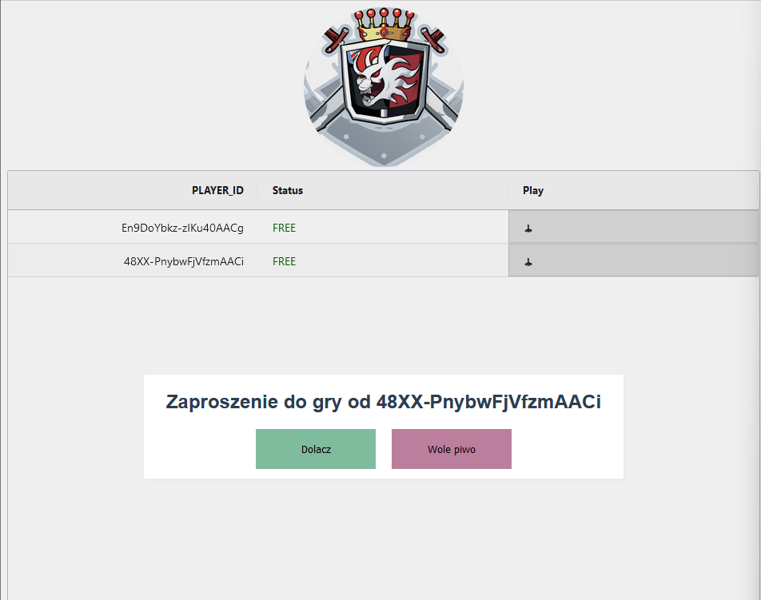
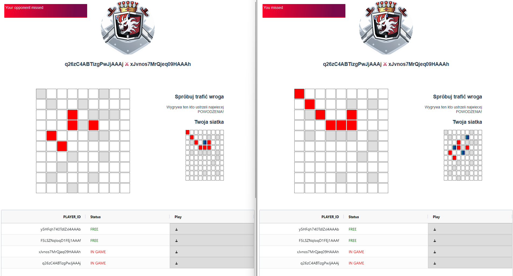
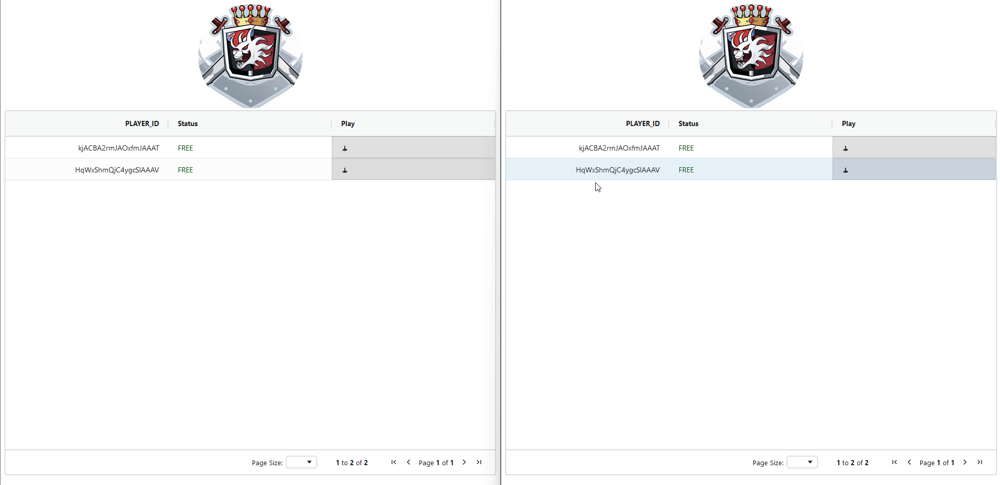

## WARSHIPS
#### Tiny multiplayer game that allows any player to join the server and conquer
````
(
 node version v15.14.0.
 If some lib is incompatible, please use npm i --legacy-peer-deps
 
 )
------
npm i && npm run serve
cd server && npm i && node main.mjs
````
# 1. Online activity
- Waiting room informs you as a new player has appeard


# 2. Invitation 
- As you were chosen to play you will receive an invite
- 

# 3. Ships allocating
- In the first stage you need to allocate all of your available ships
- Application is informing about activites during session

# 4. Who shoot all the opponent's ships faster - WIN


# Made with socket.io, express.js, Vue3, Ag Grid
## MIT
#### Mateusz Świderski, mateuszss00b@gmail.com

-------------

